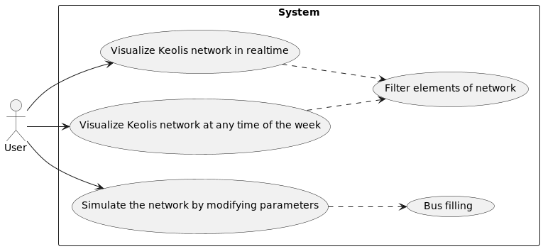

# Software Architecture Document

## Version 1.0
 |    Date    | Version |                  Description                   |    Author   |
 |------------|---------|------------------------------------------------|-------------|
 | 04/01/2023 |   1.0   | Software Architecture generated using Markdown | Y. Paillard |

# Table of Contents
1. [Introduction](#introduction)
    1. [Purpose](#purpose)
    2. [Scope](#scope)
    3. [Definitions, Acronyms and Abbreviations](#definitions-acronyms-and-abbreviations)
    4. [References](#references)
2. [Architectural Representation](#architectural-representation)
3. [Architectural Goals and Constraints](#architectural-goals-and-constraints)
4. [Use-Case View](#use-case-view)
    1. [Architecturally-Significant Use Cases](#architecturally-significant-use-cases)
        1. [Visualize Keolis network in realtime](#visualize-keolis-network-in-realtime)
        2. [Visualize Keolis network at any time of the week](#visualize-keolis-network-at-any-time-of-the-week)
        3. [Simulate the network by modifying parameters](#simulate-the-network-by-modifying-parameters)
        4. [Filter elements of network](#filter-elements-of-network)
        5. [Bus filling](#bus-filling)
5. [Logical View](#logical-view)
    1. [Architecture Overview – Package and Subsystem Layering](#architecture-overview-package-and-subsystem-layering)
6. [Process View](#process-view)
    1. [Processes](#processes)
    2. [Process to Design Elements](#process-to-design-elements)
    3. [Process Model to Design Model Dependencies](#process-model-to-design-model-dependencies)
    4. [Processes to the Implementation](#processes-to-the-implementation)
7. [Deployment View](#deployment-view)
    1. [Description of one of the deployment node TODO : describe](#description-of-one-of-the-deployment-node)
8. [Size and Performance](#size-and-performance)
9. [Quality](#quality)

#  Introduction
##  Purpose
This document provides a comprehensive architectural overview of the system, using a number of different architectural views to depict different aspects of the system. It is intended to capture and convey the significant architectural decisions which have been made on the system.

##  Scope
TODO

##  Definitions, Acronyms and Abbreviations
TODO

##  References
* [PlantUML Documentation](https://plantuml.com/)
* [Report template](https://www.ecs.csun.edu/~rlingard/COMP684/Example2SoftArch.htm)

#  Architectural Representation
This document presents the architecture as a series of views; use case view, logical view, process view and deployment view. There is no separate implementation view described in this document. These are views on an underlying Unified Modeling Language (UML) model developed using PlantUML. 

#   Architectural Goals and Constraints
There are some key requirements and system constraints that have a significant bearing on the architecture. They are:

TODO

* Constraints 1
* Constraints 2

#   Use-Case View
A description of the use-case view of the software architecture. The Use Case View is important input to the selection of the set of scenarios and/or use cases that are the focus of an iteration. It describes the set of scenarios and/or use cases that represent some significant, central functionality. It also describes the set of scenarios and/or use cases that have a substantial architectural coverage (that exercise many architectural elements) or that stress or illustrate a specific, delicate point of the architecture.

## Architecturally-Significant Use Cases

### Visualize Keolis network in realtime
TODO
### Visualize Keolis network at any time of the week
TODO
### Simulate the network by modifying parameters
TODO
### Filter elements of network
TODO
### Bus filling
TODO

#   Logical View
A description of the logical view of the architecture. Describes the most important classes, their organization in service packages and subsystems, and the organization of these subsystems into layers. Also describes the most important use-case realizations, for example, the dynamic aspects of the architecture. Class diagrams may be included to illustrate the relationships between architecturally significant classes, subsystems, packages and layers.

TODO : describe
## Architecture Overview – Package and Subsystem Layering

TODO : describe

#   Process View
A description of the process view of the architecture. Describes the tasks (processes and threads) involved in the system's execution, their interactions and configurations. Also describes the allocation of objects and classes to tasks.

TODO : describe

## Processes

TODO : describe

## Process to Design Elements

TODO : describe

## Process Model to Design Model Dependencies

TODO : describe

## Processes to the Implementation

TODO : describe

#   Deployment View
A description of the deployment view of the architecture Describes the various physical nodes for the most typical platform configurations. Also describes the allocation of tasks (from the Process View) to the physical nodes.

TODO : describe

## Description of one of the deployment node
TODO : describe
etc.

#   Size and Performance
TODO : describe
#   Quality 
TODO : describe
