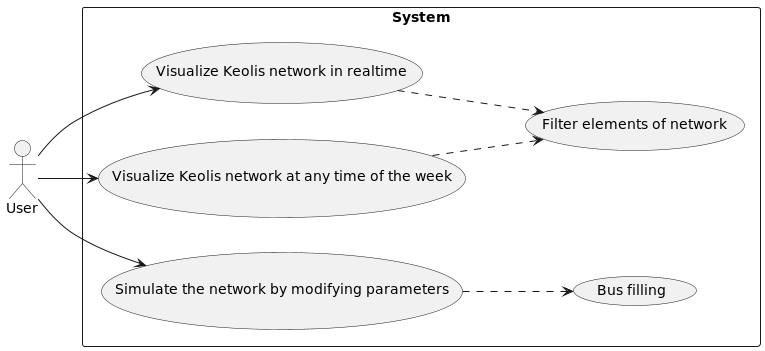

# Diagrams

>
> ### [Use Case Diagram](global/useCase.puml)
>
> 

### [Frontend](frontend/README.md)
### [Backend](backend/README.md)
### [Data Processing Unit](processingunit/README.md)
### [Database Module](databasemodule/README.md)
### [Collector](collector/README.md)